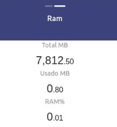
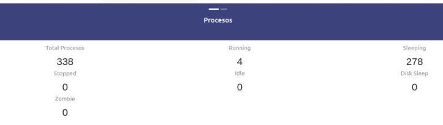
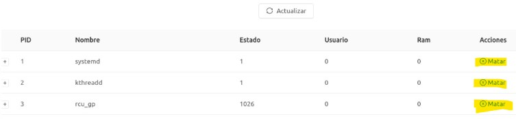

# Monitorizaicón de Procesos y Memoria
---
# Objetivos 📝

* Familiarizarse con la terminal de Linux y comandos de sistema y usuario

* Aprender a crear, monitorizar y montar procesos del Kernell de Linux.

* Poner en práctica los conocimientos sobre el Kernel de Linux.
---
## Heramientas 🛠️

* Modulos del Kernel
	* __mem_grupo18:__ extrae información sobre el uso de memoria en el sistema.
	* __cpu_grupo18:__ Éste mostrará de manera tabulada todos los procesos que están siendo ejecutados en el
servidor, así como un resumen de los procesos.

* Go:
Go es un lenguaje de programación relativamente nuevo; su primera versión fue liberada al público en 2009, [aca el link](https://golang.org/) al sitio Web oficial .

* React:
React está basado en un paradigma llamado programación orientada a componentes en el que cada componente es una pieza con la que el usuario puede interactuar. Estas piezas se crean usando una sintaxis llamada JSX permitiendo escribir HTML (y opcionalmente CSS) dentro de objetos JavaScript, [aca el link](https://es.reactjs.org/) al sitio Web oficial 

---
# Navegacion

El sitio web cuenta con dos pestañas
* RAM

* Procesos

* Tabla de procesos


---

# Modulos de Kernel

## Cpu (procesos)

```
>cd Modulos/cpu
>sudo make
```

Montar modulo

```
>sudo insmod cpu_grupo18.ko
```

Mostra mensaje

```
>sudo dmesg
```

Limpiar la carpeta donde se compilo el modulo

```
>sudo make clean
```

Desmontar el modulo

```
>sudo rmmod cpu_grupo18.ko
```


## Ram 

```
>cd Modulos/ram
>sudo make
```

Montar modulo

```
>sudo insmod mem_grupo18.ko
```

Mostra mensaje

```
>sudo dmesg
```

Limpiar la carpeta donde se compilo el modulo

```
>sudo make clean
```

Desmontar el modulo

```
>sudo rmmod mem_grupo18.ko
```

# API


* Se necesita tener instalado go
* cd /API
* go get -u github.com/gorilla/mux
* go run main.go


## Funcionamiento API

* Si todo funciona bien ir a http://localhost:8080/
```json
{
	"StatusCode":200,
	"Msg":"SERVER OK"
}
```

* Formato para RAM http://localhost:8080/ram
	* Metodo: GET


* Formato para Kill Proceso http://localhost:8080/kill/{id}
	* Metodo: GET
	* Enviar numero ID del proceso

* Formato para Procesos CPU http://localhost:8080/cpu
```json
[
	{
		"PID":int,
		"Nombre":"string",
		"Estado":int,
		"uid":int,
		"mm":int,
		"sub":[
		{
			"PID":int,
			"Nombre":"string",
			"Estado":int,
			"uid":int,
			"mm":int
		},
		{
			"PID":int,
			"Nombre":"string",
			"Estado":int,
			"uid":int,
			"mm":int
		}
		]
	}
]

```